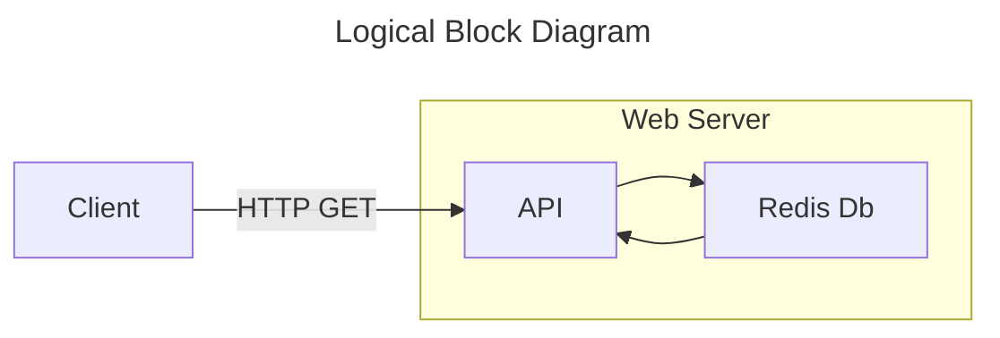
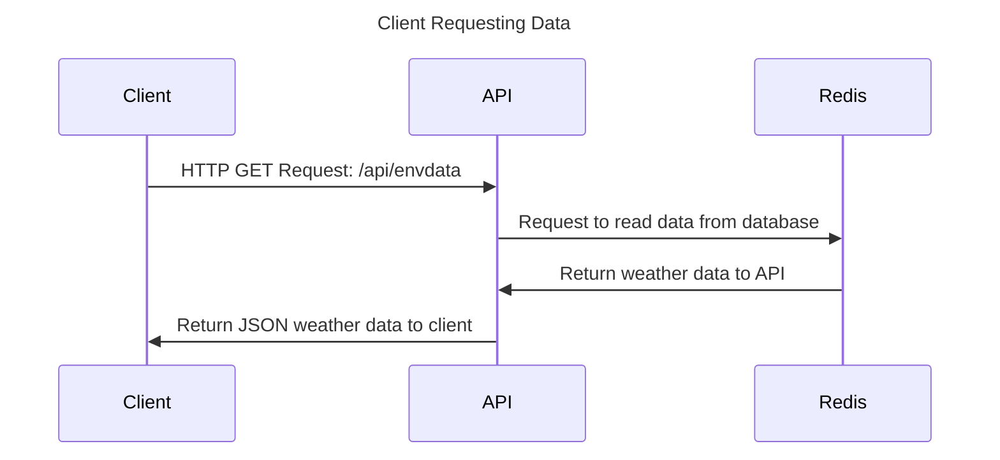

# Overview

The Bradley Weather Station web API allows access to weather data collected from the Weather Station. The API is written in Typescript and ran using the Node.js javascript runtime and express.js library. 

Logically, the API also acts as the orchestrator between the database, and consumers of the contained data. The API must be installed on the same server as the redis database. The API runs on port `27500`. (The port can be changed by altering source code)





## Requesting Data

Data is requested from the API over a HTTP(S) GET request. The API returns data in the JSON format. Supported endpoints are:

| Endpoint | Supported Methods |
| --- | --- |
| /api/envdata | GET |

### GET /api/envdata

Data is returned in JSON.

Example:
```json
{
    "weatherData": [
    {
      "timestamp_unix_ms": "1745009674533",
      "temp_c": "24.94",
      "humid_prcnt": "27.75",
      "pressure_kpa": "98.62",
      "gas_kohms": "291.16",
      "rain_an": "0",
      "light_an": "3899"
    },

    // ...

    ]
}
```

The root object: The `weatherData` array, contains the following members:

| Key | Description
| --- |  --- |
| timestamp_unix_ms | `unix-timestamp-ms`-`sample-num`, Timestamp when sample was taken |
| temp_c | Ambient air temperature, in degrees celsius |
| humid_prcnt | Relative humidity, 0-100% |
| pressure_kpa | Pressure, in kilo-Pascals |
| gas_kohms | Kilo-ohms measured resistance on internal BME680 gas sensor |
| rain_an | Analog rain sensor output: no real units. Digital output of ADC |
| light_an | Analog value of photoresistor divider: no real units. Digital output of ADC |

## Posting Data

Posting data is a privileged operation that is manually added by administrators. Keys submitted by users are checked against a file in the api directory: `api.keys`, which contains hashes of user api keys manually added by admins. 

Users sending data to the `/api/envdata` endpoint over HTTP(S) POST request must define the "Authorization" HTTP header and populate the value with a pre-determined key, provisioned by administrators. The data is posted in the following format:

```JSON
{
    "timestamp_unix_ms": "1745009674533",
    "temp_c": "24.94",
    "humid_prcnt": "27.75",
    "pressure_kpa": "98.62",
    "gas_kohms": "291.16",
    "rain_an": "0",
    "light_an": "3899"
}
```

Note that the `light_level` and `is_raining` values are the same here as in the GET request description.

!!! danger "Security"
    It is the responsibility of admins to follow security guidelines listed in this documentation, and other sources, to protect privileged operations like posting data. 