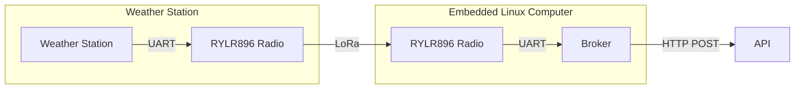

# Introduction

The broker is the software used to forward data from the Weather Station. The broker handles the data between the packets received on the attached radio, and the API running in the cloud. The broker is written in C++, and is designed to run on POSIX systems that also have the necessary dependencies installed as listed in the software build documentation.

A logical diagram of the broker is below:

