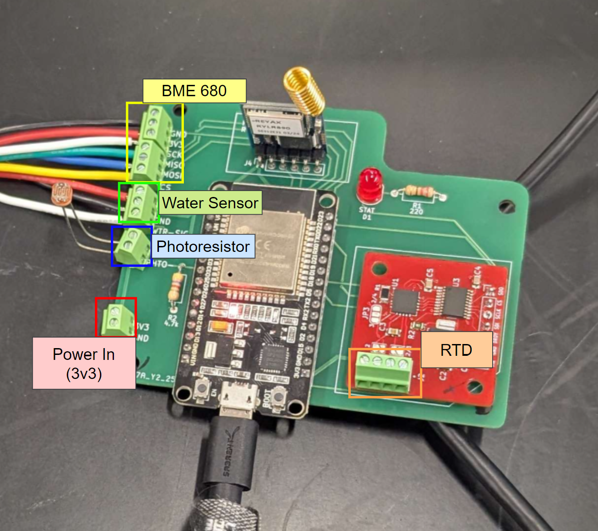

## User Wiring

The following diagram shows what parts wire to where on the control board. The control board has labels for each connection on the corresponding module. 

## Control Board Schematic

Below is the schematic for the control board, showing where all the connections go internally on the PCB.

## Notes

* The photoresistor is at roughly 2k Ohms in a well-lit room