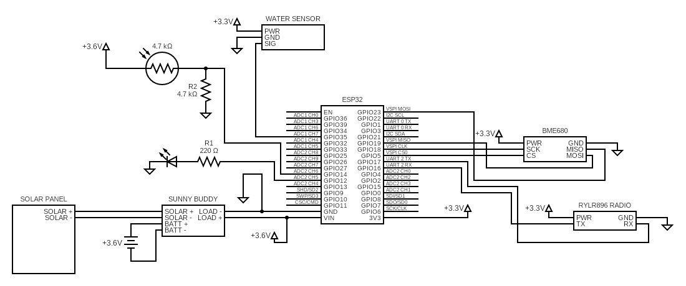

The following is the master circuit diagram for the weather station hardware deployed remotely. Reference the build requirements parts list for specific part details.

## Notes:

* The photoresistor is at roughly 2k Ohms in a well-lit room