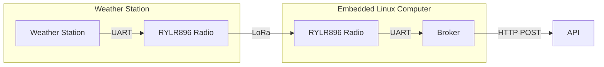

# Introduction

The broker is the software used to forward data from the Weather Station. The broker handles the data between the packets received on the attached radio, and the API running in the cloud. The broker is written in C++, and is designed to run on POSIX systems that also have the necessary dependencies installed as listed in the software build documentation.

A logical diagram of the broker is below:

# Running the Broker

The broker application comes with a file: `start-broker.sh` that gives an example for starting the broker. It is up to the user to find the device file that corresponds to the connected RYLR896 radio. There are lots of tutorials for this on the internet, but some useful commands are:

- `ls -l /dev/tty*` -> List attached tty device files. Some common names are `ttySX`, `ttyACMX`, `ttyUSBX`, depending on how the port is connected.
- `sudo picocom -b <baud rate> <device file>` -> Open a terminal to read data from serial port

**start-broker.sh** example:

`./build/bradley-cast-broker /dev/ttyS0 https://weather.jacobsimeone.net/api/envdata ./api.key`