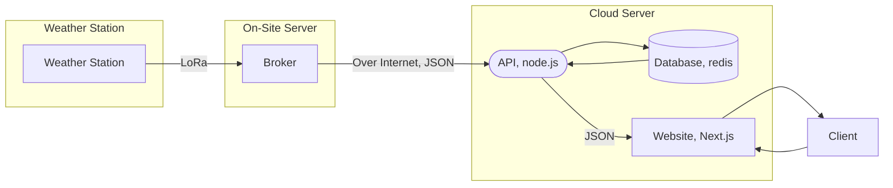

The ECE 398 Weather Station was designed and realized by students enrolled in Vertically Integrated Projects in the Electrical Engineering department at Bradley University. This project aims to provide students on Bradley's campus a way to monitor and log weather data. In the future, we hope this project expands to hosting multiple weather nodes that can all work together to accurately predict weather on campus.

In its current form, the Weather Station is just one node that uploads data to a server which is accessible at [weather.jacobsimeone.net](https://weather.jacobsimeone.net).

This site serves to document the Weather Station software and provides instruction for running the software on other systems efficiently.

CAD models can be found on [OnShape](https://cad.onshape.com/documents/38c15368c41f2224b0adceca/w/e0d05cb6b75a73d47582f798/e/6f88f03cdb676fd77e352c81?renderMode=0&uiState=679021283de53a2916d306de).

## Design Overview

The ECE 398 Weather Station project is split up into four primary pieces of software:

* The **Firmware**, which runs on the microcontroller that collects the data
* A **Broker**, which "translates" LoRa messages into network traffic that can be posted to the API
* An **API**, used for saving data to a database and accessing said data later
* The **Website**, an example of implementation for what one can do with the data and is how we currently share our data.

The Weather Station, equipped with a LoRa radio, transmits data to a broker equipped with the same radio where the data is parsed and converted into JSON to publish to the API. The API then saves that data to a Redis database located on the same physical server which can also be hosting the website. (The website can be hosted remotely, but you will need to set the API endpoint) Clients can then connect to the website to view data served by the API.

!!! warning "Broker Radio Location"

    However the radio is connected to the on-site server is fine, but the radio on the Weather Station and the radio on the broker must be **in range** of each other.

## Tech Stack

Maintainers of the Weather Station should be proficient in the following technologies to effectively support the Weather Station system:

### Firmware

* [PlatformIO](https://platformio.org/) - an IDE that works with VsCode and the Arduino framework
* [ESP32](https://www.espressif.com/en/products/socs/esp32) - Microcontroller used in the Weather Station (can be swapped in the future)
* [LoRa](https://www.digikey.com/en/maker/tutorials/2016/introduction-to-lora-technology) - Long-Range radio communication technology used to transfer data

### API
* [node.js](https://nodejs.org/en) with typescript
* [redis database](https://redis.io/nosql/what-is-nosql/#What%20is%20Redis%20NoSQL?) - For storing weather data
* [Nginx](https://nginx.org/en/) - Web server

### Website
* [Next.js](https://nextjs.org/) web framewortk

## User Manual

* TODO: LED Codes