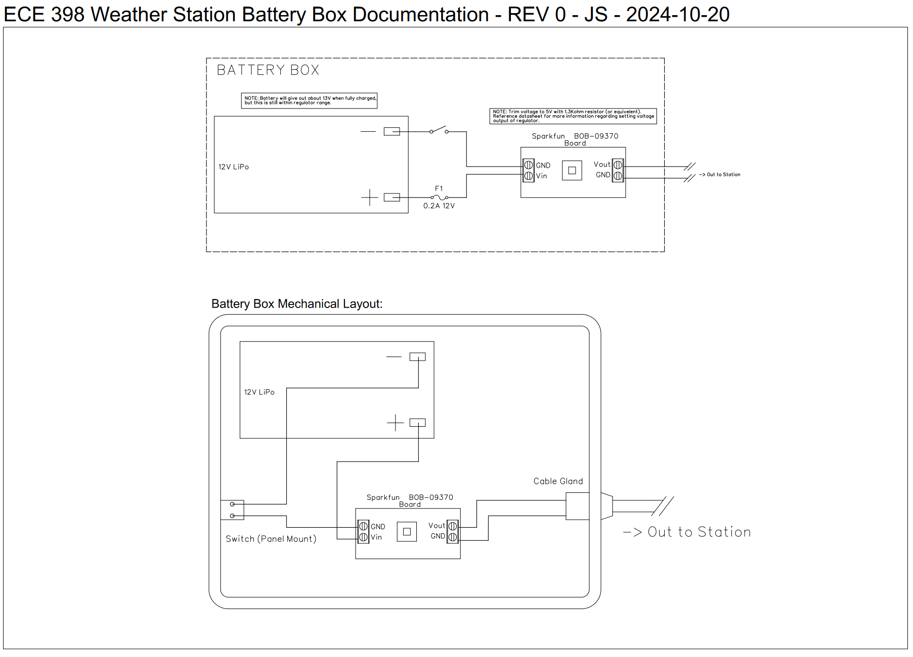

## Measuring Internal Battery Box Temperature

In order for the weather station to be deployed outdoors in an environment where a USB port may not be available, we are designing a battery box that we will use to power the station. It sports a 10Ah Lithium Ion battery with a on/off switch, cable gland, and all of that packed in an amazon waterproof case. 

It looks a little like this: 

> *Battery box from setup for thermal testing, 2024-10-19*

> *Battery box under the new production weather station, on the first build day of the battery box, 2024-10-17*

The schematics for the box (although crude) look like so:

> *Battery box schematics as of *2024-10-20*

## Temperature Consideration

We are using a switching regulator to step the nominal 12V down to a nominal 5V. Because this box was going to be set up relatively long term, outside in the elements, we wanted a good idea of the thermals inside of the box. In order to accomplish this, we measured the internal temperature of the box while under an expected load. 

To measure the temperature, we used a thermocouple and some logging software to monitor the temperature over time. You can see the thermocouple location in the first image of this article. I set up the test with the box closed, and let it run until the temperature seemed to level off. 

This was what my (very messy) setup looked like. Note I'm using a personal project with an LCD display and microcontroller to simulate the load: 

> *Setup of thermal measurement test*

## Results

After some time, it was found that the temperature leveled off at about 97 degrees F, which was a little more than 20 degrees over ambient. All things considered, this was a pretty good result and we are going to move forward with deploying this system. 

> *Results of test performed on 2024-10-19*

> Last edited by Jacob Simeone - 2024-10-20
