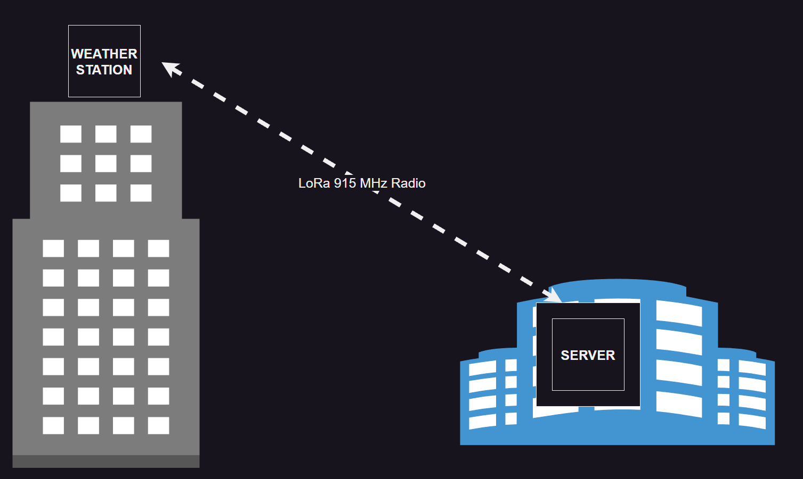
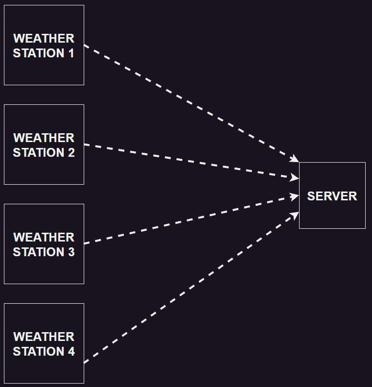

This is the proposed "Bradley-Cast" binary protocol that the weather station will (hopefully) eventually use. Currently, the Weather Station implements a simpler ASCII-based protocol which is documented elsewhere.

!!! warning "Protocol Not Part of Weather Station Right Now"

    This is a *proposed* protocol, and is currently UNIMPLEMENTED. See the README for details on ASCII encoded protocol currently implemented. Note the radio being used currently does NOT support raw, binary data transmission. 

## Development Overview

The protocol defining messages that the microcontroller will send over the LoRa 915Mhz radio link. 

This will focus on transmitting sensor data to the Raspberry Pi when there are multiple microcontrollers with different sensors.

### **DATA**

We have the following integer data to transmit:

| Name | Bits | Unit | Scale | Signed? | 
| ---  | ---  | ---  | ---   | ---     |
| Temperature | 16 | deg C | x100 | yes |
| Humidity | 16 | percent | x100 | no |
| Pressure | 16 | kPa | x100 | no |

Notice the scale parameter set in the table. This is to guarantee fixed point data only on the link between the microcontroller and the Pi.

Example: The temperature sensor reads 25.62°C, which is 32 bit. We don't want to transmit the decimal point, as that increases the bit count. Instead, we can do this:
In the microcontroller, multiply the value by 100. 25.62 x 100 = 2562. Then we transmit this to the Raspberry Pi.
The Raspberry Pi picks up 2562, and we tell the Pi to divide the value by 100, turning it back into 25.62°C. This is where the scale comes from. 

We also need to transmit the following:

- Is it raining?
- Is it cloudy? Sunny? Gloomy?

**Is Raining?** shall just be one bit, on or off

**Sunny/Cloudy/Gloomy** we can use 2 bits to represent each state as an integer:

- `0b00` (0 decimal): **Sunny**
- `0b01` (1 decimal): **Cloudy**
- `0b10` (2 decimal): **Gloomy**

We can export Raining and Sunny/Cloudy/Gloomy together as 3 bits and add 5 bits of padding to export in 8 bit which results in total data being:

| Name | Bits | Unit | Scale | Signed? | 
| ---  | ---  | ---  | ---   | ---     |
| Temperature | 16 | deg C | x100 | YES |
| Humidity | 16 | percent | x100 | NO |
| Pressure | 16 | kPa | x100 | NO |
| RSCG | 8 | mixed | N/A | NO |

Where `RSCG` is:

<table>
  <tr>
    <td colspan="5">RESERVED</td>
    <td colspan="2">Cloudy/Sunny/Gloomy</td>
    <td>IS RAINING?</td>
  </tr>
  <tr>
    <td>0b111</td>
    <td>0b110</td>
    <td>0b101</td>
    <td>0b100</td>
    <td>0b011</td>
    <td>0b010</td>
    <td>0b001</td>
    <td>0b000</td>
  </tr>
</table>

> From here on out, Rain, Sunny/Cloudy/Gloomy will be referred to as: `RSCG`.

### **Unique Identifiers**

However, we are assuming that the Raspberry Pi is receiving data from different microcontrollers. 
Thus, we need a way to identify the microcontrollers so that the Pi can differentiate between them. We do this with an ID.
We add a unique ID in front of the microcontroller and the environmental message.
The transmission would look like this:

`[ID][ENV MSG]` instead of just `[ENV MSG]` to the Raspberry Pi.
Now we can have unique IDs for each microcontroller to send data to the Pi.

**ID Examples**

Temp ID = 0 (integer) 00 (binary)

Humid ID = 1 (integer) 01 (binary)

Pres ID = 2 (integer) 10 (binary)

RSCG ID = 3 (integer) 11 (binary)

## Message Specification

All messages shall be sent in the following format, and shall be in network byte order:

<table>
  <tr>
    <td>STATION ID (64-bit)</td>
    <td>MSG ID (16-bit)</td>
    <td>MSG (Variable-length)</td>
  </tr>
</table>

### Station ID Specification:

A STATION ID will be a unique identifier assigned to each unique device communicating with the broker. The STATION ID will have the following requirements:

- exactly 64 bits long
- MSB format on message transmission

### Message ID Specification:

Each message shall have a message ID attached to it, identifying the type of data contained in the message. The message ID shall:

- Be exactly 2 bytes
- Be populated after the UUID of the device sends the message

## Messages

Technical descriptions of each message capable of being sent over the Bradley-Cast protocol. 

### **ENV Data Message**

<table>
   <tr>
     <td>ID:</td>
     <td>0x0010</td>
   </tr>
</table>

**FORMAT:**

<table>
   <tr>
     <td>Temperature (16 bits)</td>
     <td>Humidity (16 bits)</td>
     <td>Pressure (16 bits)</td>
     <td>RSCG (8 bits)</td>
   </tr>
</table>

**WHERE:**

<table>
  <tr>
    <th>NAME</th>
    <th>UNITS</th>
    <th>SCALE</th>
    <th>SIGNED?</th>
    <th>LEN (BYTES)</th>
  </tr>

  <tr>
    <td>Temperature</td>
    <td>Degrees C</td>
    <td>$10^2$</td>
    <td>YES</td>
    <td>2</td>
  </tr>
  <tr>
    <td>Humidity</td>
    <td>Percent</td>
    <td>$10^2$</td>
    <td>NO</td>
    <td>2</td>
  </tr>
  <tr>
    <td>Pressure</td>
    <td>kPa</td>
    <td>$10^2$</td>
    <td>NO</td>
    <td>2</td>
  </tr>
  <tr>
    <td>RSCG</td>
    <td>ENUM / BOOL</td>
    <td>1</td>
    <td>NO</td>
    <td>1</td>
  </tr>
</table>

**RSCG - DETAILS**
<table>
  <tr>
    <td colspan="3">RESERVED</td>
    <td colspan="2">Cloudy/Sunny/Gloomy</td>
    <td>IS RAINING?</td>
  </tr>
  <tr>
    <td>0b1111</td>
    <td>...</td>
    <td>0b011</td>
    <td>0b010</td>
    <td>0b001</td>
    <td>0b000</td>
  </tr>
</table>

**VALID VALUES OF CLOUDY/SUNNY/GLOOMY:**

- `Sunny` = 0
- `Cloudy` = 1
- `Gloomy` = 2

Example Payload (in hex): 

<table>
  <tr>
    <td>01</td>
    <td>90</td>
    <td>10</td>
    <td>16</td>
    <td>27</td>
    <td>FD</td>
    <td>03</td>
  </tr>
</table>

`0x03 = 0b00000011` -> Is raining, and is also cloudy

With:
- Temperature = 4 degrees C
- Pressure = 102.37 kPa
- Humidity = 41.18 %
- IS RAINING
- CLOUDY