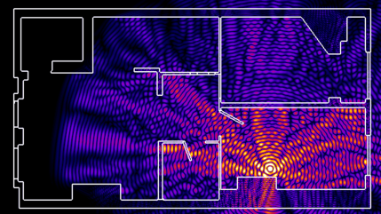

# Range Issues

Since the first prototype release of the weather station on March 1st, 2024, it's been noted by members of the weather station project that the range is near pitiful. A test was performed on 2024-03-04, which found that walking around the fourth floor, the WiFi signal from the ESP32 was recognizable all throughout the fourth floor, showing a low of `~89db` at some points. 

In this wiki, I want to answer, using some RF calculations why this may be the case. 

# Range in Math

There are ways to calculate this kind of thing, making lots of assumptions. You can find more information [here](https://www.electronicdesign.com/technologies/communications/article/21796484/understanding-wireless-range-calculations), written by people far smarter than myself. 

The long story short is this: **How far can the signal, transmitted from the ESP32, reach?**

To get the distance, we need to know a few things:

- `Frequency (MHz)` -> What frequency our WiFi network is on
- `Transmit Power (db)` -> This is the amount of power coming out of the antenna on the weather station.
- `Receive Sensitivity (dbm)` -> The minimal amount of power needed to receive from a transmitter
- `Antenna Gain (db)` -> The amount of power an antenna adds through directionality or, how much power an antenna can focus.
- `Fade Margin (db)` -> This is a margin used for the power we would like to receive at above the minimum receiver sensitivity
- `Other Losses (db)` -> I'm lumping walls, reflections, and whatnot into this category. 

In our case, we're working with the following parameters:

- `Frequency = 2400 MHz` -> Another assumption, this could actually change a bit depending on the channel, but the ESP32 seems to dwell on channels that are close to this based off of very limited testing
- `Transmit power = 20db` -> Configured in code, and is the maximum output power of the ESP32
- `Receive Sensitivity = -85dbm` ->  Typical sensitivity of a common 802.11g module, according to google. 
- `Antenna Gain = 1db` -> A typical value for a PCB antenna
- `Fade Margin = 15db` -> A number that's kind of wishy-washy, but on the high end of what the source I linked above recommended. This is because of all the extra "stuff" in the rf space here at Bradley University, as well as the changing number of walls the signal will have to go through. 

**The Next Thing** we need to know, is the [Free Space Path Loss](https://en.wikipedia.org/wiki/Free-space_path_loss#Derivation) formula. Specifically, the form of the equation which uses km for distance and GHz for frequency:

$$
\text{FSPL} = 20\log_{10}{d_{km}} + 20\log_{10}{f_{GHz}} - 92.45
$$

Where:

- $f$ is frequency, in GHz
- $d$ is distance, in km

Next, we need to know our **Maximum path loss** for the next formula. The maximum path loss is the difference between your effective transmit power, and your effective receive power.

**In other words, how much power can I lose before the signal strength is too low?**

Maximum path loss is roughly this (with some assumptions):

$$
\text{Max path loss} = \text{Tx power} - \text{Rx sensitivity} + \text{Tx gain} - \text{Fade margin} - \text{other losses}
$$

Re-arranging this formula for distance ($d$) gives us the following:

> [source](https://www.electronicdesign.com/technologies/communications/article/21796484/understanding-wireless-range-calculations) (Please note that units change from frequency was in GHz and is now in MHz)

$$
d_{km} = 10^{(\text{max path loss} - 32.44 - 20\log_{10}{f_{MHz})/20}}
$$

# Other Losses

We need to account for other RF losses, which in our case, are mostly walls. I'm accounting for:

- `4 walls average = 7db * 4 = 24db` -> Very arbitrarily assuming 10.5" brick walls, with the 7db loss coming from [this](https://securitytoday.com/Articles/2012/04/01/Indoor-Wireless-Path-Loss.aspx) source. (I'm mostly making these numbers up, these could be improved)

# Range Solution

The very very very crude estimated range solution is this:

$$
\text{Max Path Loss} = 20 - (-85) + 1 - 15 - 24 = 67\text{db}
$$

$$
d_km = 10^{ ( 67 - 32.44 - 20\log_{10}{2400} ) / 20} = 0.0222735\text{km} \approx 22\text{m}
$$

Our estimate is approximately: `22 meters` or `roughly 72 feet`. This is a fair estimate of the range that I observed while testing. 

> **Note: This math makes a ton of assumptions and stuff like this isn't easy to calculate, so this number could be quite far off**

# Other Factors That Effect Range

Antenna polarization -> Our antenna probably isn't a [isotropic radiator](https://en.wikipedia.org/wiki/Isotropic_radiator) which means that the signal strength is going to change based on the side of the antenna you're facing. 

> [source](https://www.google.com/url?sa=i&url=https%3A%2F%2Fblogs.getcertifiedgetahead.com%2Fwireless-antenna%2F&psig=AOvVaw3EV-dKcspVmDc5e7fCfE_I&ust=1709751713230000&source=images&cd=vfe&opi=89978449&ved=0CBMQjRxqFwoTCLCQtc_n3YQDFQAAAAAdAAAAABAI)

More walls -> My wall loss estimation accounts poorly for obstacles, this number may be too high, or too low and is causing an inaccurate estimation.

> [source](https://www.google.com/url?sa=i&url=https%3A%2F%2Fluvatfirstbyte.wordpress.com%2F2018%2F11%2F20%2Fwifi-that-sees-through-walls%2F&psig=AOvVaw1xMESYP1pUSkyHeK3kCj3w&ust=1709751783820000&source=images&cd=vfe&opi=89978449&ved=0CBMQjRxqFwoTCPDE_PDn3YQDFQAAAAAdAAAAABAJ)

Elevation -> Since most of the power of the antenna is radiated horizontally, lowering your elevation relative to it is going to significantly decrease your signal strength. (Walk a couple steps down the stairs and see how fast you lose signal)

---

Srouces:

- [electronicdesign.com](https://www.electronicdesign.com/technologies/communications/article/21796484/understanding-wireless-range-calculations)
- [securitytody.com](https://securitytoday.com/Articles/2012/04/01/Indoor-Wireless-Path-Loss.aspx)

