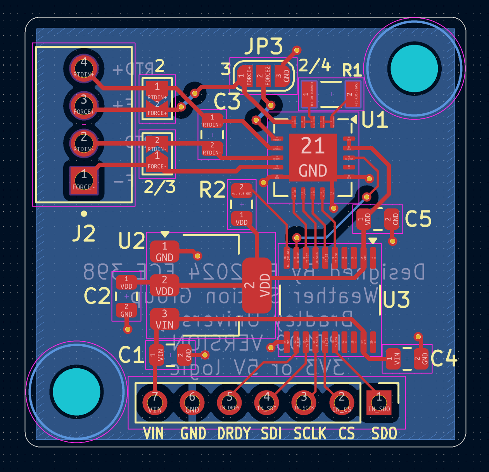

The BU Weather Station needs to be able to measure temperature in order to function like a weather station. In fact, the temperature may be the most important piece of information for the station to export to users, as it is what users are interested in. Reporting (and logging) that temperature accurately is very important. 

During development, we used both a BME680 and BME280 environment sensor from Bosch-Sensortec. Both of these sensors have an accuracy of +- 0.5-1 degree celsius. 

To solve these issues, and as an exercise, the BU Weather Station team decided to make a custom printed circuit board (PCB) to carry a sensor capable of turning an RTD (Resistive Temperature Device) signal into a high-accuracy temperature. This board is shown below.

This board includes:

* An [Analog Devices MAX31865 RTD to digital converter](https://www.digikey.com/en/products/detail/analog-devices-inc-maxim-integrated/MAX31865ATP-T/3758925)
* A [NCP1117 3.3V fixed output voltage regulator](https://www.digikey.com/en/products/detail/onsemi/NCP1117ST33T3G/1749063)
* A [Texas Instruments TXB0108PWR Level Translator](https://www.digikey.com/en/products/detail/texas-instruments/TXB0108PWR/1305699)

The RTD to digital converter converts a RTD signal to a temperature the microcontroller can read through SPI. This board can be used with 2, 3, or 4 wire RTDs by jumping the corresponding pads. The voltage regulator and level translator allow the board to be used with either 3v3 or 5v supplies and logic. 

## Manufacturing

The board and components came seperate, which meant the BU Weather Station team had to assemble the board themselves. Most boards like this are either hand-soldered or reflow-soldered in an oven. The BU Weather Station team opted to manufacture our board with reflow-soldering. This was done using an off-the-self toaster oven with a custom software/hardware solution as well as a stencil from [OshStencils](www.oshstencils.com).

> Custom reflow-oven