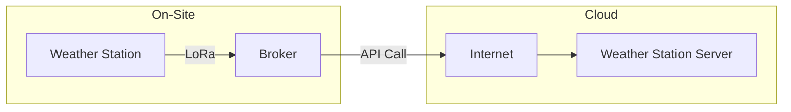

This tutorial describes how to build the software suite for the weather station. Make sure the target system(s) have the required software as described in the previous section.

## Clone the Repository

Before building any software, you must have the most recent stable release of the weather station software suite located at our [GitHub Repository](https://github.com/ImtiazAtBradley/VIP_Weather/tree/main). All target devices must have the software needed to build the various services.

!!! info "Transferring Source to Other Computers"

    Because each target needs software (broker/api/firmware/website), it is recommended to get the repository on some development computer that will be able to "deploy" that software to those targets. For example, using a laptop to ssh into the server running the broker, or the api and website and copying the files over that connection. A great GUI tool for Windows to do this is [WinSCP](https://winscp.net/eng/index.php).

## Broker

The Broker is the service that relays information between the deployed weather station, and the deployed server that holds the weather data. The broker is written using C++, using the [libcurl library](https://curl.se/libcurl/). Below is a simple block diagram of the broker's job:



!!! info "Operating System"

    The following instructions are assuming you are running a debian-based operating system.

### Prerequisites

Install the following packages to build the broker:

```bash
sudo apt install cmake libcurl4-openssl-dev
```

This installs:

* `cmake` For building the project
* `libcurl4-openssl-dev` To get libcurl, which is used in the broker. If this package doesn't work, get your system's equal of the libcurl4 library using openssl.

### Building the Broker

Change directory into the `/broker/broker` directory.

Run the following command:

```bash
bash ./build.sh
```

This will build both the `bradley-cast-broker` and `bradley-cast-broker-test` executables.

### Running the Broker

Running the broker requires the serial device file attached to the RYLR896 radio, the API endpoint of the server, and the api key file that is attached to the JSON request header.

The following "help" will be outputted when the executable is ran:
```
INVALID INPUT. SEE USAGE:


BRADLEY CAST BROKER - ACCESS POINT OF WEATHER STATIONS TO SERVER DATABASE

AUTHORS:
  BRADLEY UNIVERSITY ECE398 WEATHER STATION PROJECT GROUP 2024
USAGE: 
  bradley-cast-broker [serial dev file] [API URL] [API key file]
```

You would run the broker like so:

```
bradley-cast-broker https://your.domain.com/api/envdata ./your-key-file.key
```

### Broker Protocol (Incoming from Radio)

The ASCII protocol used to transfer data between the Weather Station and the Broker is like so:

```
T00.00|H00.00|P00.00|R<0 or 1>|L<0,1,2>
```

An example payload could be:

```
T32.12|H89.34|P99.88|R1|L2
```

## API & Website

* Firewall
* Nginx

## Firmware 

* directory
* cp2102 drivers
* pinout

Ensure that an ESP32-DevkitM1 board is attached to your computer through a USB cable before attempting to flash firmware. 

!!! warning "CP2102 Device Drivers"

    The ESP32-DevkitM1 board uses a CP2102 USB-to-UART chip to communicate between the connected USB device and the microcontroller. It is **very important** on Windows, that you have installed the [CP2102 device drivers](https://www.silabs.com/developer-tools/usb-to-uart-bridge-vcp-drivers?tab=downloads), otherwise the ESP32 cannot communicate with the attached computer. Other operating systems have not been tested.

Navigate to the `/firmware` directory in the repository, and open it in VsCode and ensure the PlatformIO extension is installed. When the project opens, make sure that PlatformIO is started, and recognizes the project, otherwise the following commands will not work.

With the project open, run the `TODO: BUILD COMMAND HERE` to build the firmware project, and then the `TODO: UPLOAD COMMAND` to upload the firmware to the attached device. The attached ESP32 should now be running the weather station firmware.

!!! info "Verify Firmware"

    To ensure that firmware is working, put the development board back in the weather station and ensure the status LED is operating.