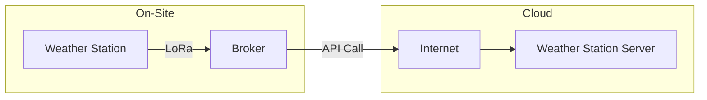
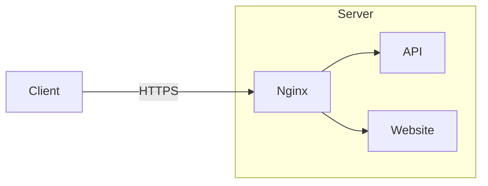

This tutorial describes how to build the software suite for the weather station. Make sure the target system(s) have the required software as described in the previous section.

## Clone the Repository

Before building any software, you must have the most recent stable release of the weather station software suite located at our [GitHub Repository](https://github.com/ImtiazAtBradley/VIP_Weather/tree/main). All target devices must have the software needed to build the various services.

## Broker

The Broker is the service that relays information between the deployed weather station, and the deployed server that holds the weather data. The broker is written using C++, using the [libcurl library](https://curl.se/libcurl/). Below is a simple block diagram of the broker's job:



!!! info "Operating System"

    The following instructions are assuming you are running a debian-based operating system.

### Prerequisites

Install the following packages to build the broker:

```bash
sudo apt install cmake libcurl4-openssl-dev
```

This installs:

* `cmake` For building the project
* `libcurl4-openssl-dev` To get libcurl, which is used in the broker. If this package doesn't work, get your system's equal of the libcurl4 library using openssl.

### Building the Broker

Change directory into the `/broker/broker` directory.

Run the following command:

```bash
bash ./build.sh
```

This will build both the `bradley-cast-broker` and `bradley-cast-broker-test` executables.

### Running the Broker

Running the broker requires the serial device file attached to the RYLR896 radio, the API endpoint of the server, and the api key file that is attached to the JSON request header.

The following "help" will be outputted when the executable is ran:
```
INVALID INPUT. SEE USAGE:


BRADLEY CAST BROKER - ACCESS POINT OF WEATHER STATIONS TO SERVER DATABASE

AUTHORS:
  BRADLEY UNIVERSITY ECE398 WEATHER STATION PROJECT GROUP 2024
USAGE: 
  bradley-cast-broker [serial dev file] [API URL] [API key file]
```

You would run the broker like so:

```
bradley-cast-broker https://your.domain.com/api/envdata ./your-key-file.key
```

!!! danger "Broker Key Security"
    
    Part of the broker's API calls is a POST request containing an API key. **NEVER** use unsecured HTTP.

### Broker Protocol (Incoming from Radio)

The ASCII protocol used to transfer data between the Weather Station and the Broker is like so:

```
T00.00|H00.00|P00.00|R<0 or 1>|L<0,1,2>
```

An example payload could be:

```
T32.12|H89.34|P99.88|R1|L2
```

## API & Website

The API handles retrieving and posting all data to the underlying redis database. All data must go through the API, including GET and POST requests. The API is built using [Node.js](https://nodejs.org/en) and is written in the [typescript](https://www.typescriptlang.org) language.

!!! warning "Redis Database"

    The redis database must be accessible at `localhost` on port `6379`. There is no security currently implemented, which is why this requirement exists.

### Installing Redis

Run the following to install redis (the database that stores all the weather data):

```bash
sudo apt-get install lsb-release curl gpg
curl -fsSL https://packages.redis.io/gpg | sudo gpg --dearmor -o /usr/share/keyrings/redis-archive-keyring.gpg
sudo chmod 644 /usr/share/keyrings/redis-archive-keyring.gpg
echo "deb [signed-by=/usr/share/keyrings/redis-archive-keyring.gpg] https://packages.redis.io/deb $(lsb_release -cs) main" | sudo tee /etc/apt/sources.list.d/redis.list
sudo apt-get update
sudo apt-get install redis
```

Ensure the redis database is running by checking the service's status using `systemctl`. You want to make sure it is running:

```bash
systemctl status redis-server.service
```

Make redis database start when computer starts with:
```bash
sudo systemctl enable redis-server
sudo systemctl start redis-server
```

### Installing Nodejs

You must install Node.js in order to run the API. Follow the instructions below to install it:

You will need to run the following to get the tools needed:

```bash
sudo apt install curl
```

Then, install Node.js

```bash
# Download and install nvm:
curl -o- https://raw.githubusercontent.com/nvm-sh/nvm/v0.40.1/install.sh | bash
# Download and install Node.js:
nvm install 22 # You may have to restart your terminal before running this
# Verify the Node.js version:
node -v # Should print "v22.13.1".
nvm current # Should print "v22.13.1".
# Verify npm version:
npm -v # Should print "10.9.2".
```

### Building the API

You must have cloned the repository, as per the requirements. Change into the `/api` directory and run the following commands from there.

Install the dependencies using npm (from inside `/api`):

```bash
npm install && npm audit fix
```

Then, build the API using:

```bash
npx tsc
```

Run the api using:

```bash
node index.js
```

### Building the Website

### Running the Website

## Securing The Server

The following sections describe recommended security-related practices for any public deployment of this server. Currently, this includes adding a production web-server in front of our API and website ([Nginx](https://nginx.org)), as well as a firewall. For this tutorial, we will be using the `ufw` firewall, but you can use whatever one you would like.

### Nginx

Nginx is a web-server that sits "in front of" the API and website. Sort of like this:



#### Installing Nginx

Run the following to install and enable the Nginx software on your system:
```bash
sudo apt install nginx
```

To verify this is working, you can go to: `https://localhost/` on the target system in a web browser, and you should see the Nginx welcome page (if you have a GUI available to you).

As always, you can check the status of nginx with `systemctl`:

```bash
systemctl status nginx
```

The nginx service should be both *running* and *enabled*.

#### Configuration

#### Getting HTTPS Working

### Firewall

It is **highly** recommended to run a firewall on the server running the API and web server. For both the API and the web server, we must allow HTTP requests. For `ufw` firewall, run:

```bash
sudo ufw allow "Nginx Full"
```
> Note the above requires Nginx to be installed to work. This opens port 80 and port 443

If `ufw` is not already enabled, you can enable it by running:
```bash
sudo ufw enable
```

!!! danger "SSH/Remote Desktop Connections"
    
    Before enabling the firewall, make sure that you have access to your server through a physical connection (like mouse and keyboard or serial port) or you allow ssh traffic with ufw like so: `sudo ufw allow 22/tcp`

## Firmware 

* directory
* cp2102 drivers
* pinout

Ensure that an ESP32-DevkitM1 board is attached to your computer through a USB cable before attempting to flash firmware. 

!!! warning "CP2102 Device Drivers"

    The ESP32-DevkitM1 board uses a CP2102 USB-to-UART chip to communicate between the connected USB device and the microcontroller. It is **very important** on Windows, that you have installed the [CP2102 device drivers](https://www.silabs.com/developer-tools/usb-to-uart-bridge-vcp-drivers?tab=downloads), otherwise the ESP32 cannot communicate with the attached computer. Other operating systems have not been tested.

Navigate to the `/firmware` directory in the repository, and open it in VsCode and ensure the PlatformIO extension is installed. When the project opens, make sure that PlatformIO is started, and recognizes the project, otherwise the following commands will not work.

With the project open, run the `TODO: BUILD COMMAND HERE` to build the firmware project, and then the `TODO: UPLOAD COMMAND` to upload the firmware to the attached device. The attached ESP32 should now be running the weather station firmware.

!!! info "Verify Firmware"

    To ensure that firmware is working, put the development board back in the weather station and ensure the status LED is operating.